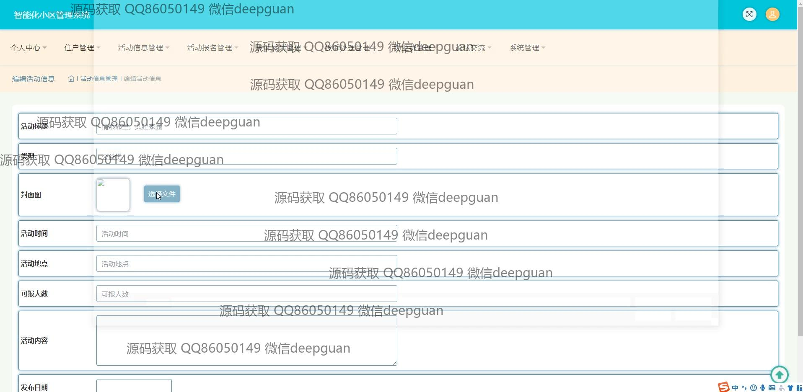
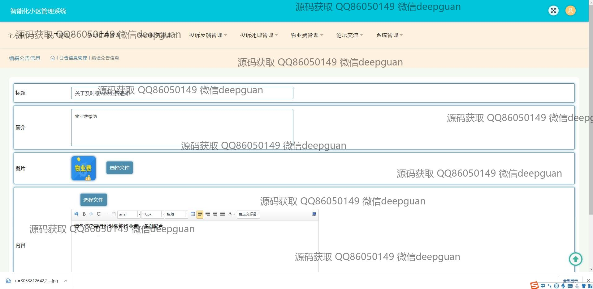
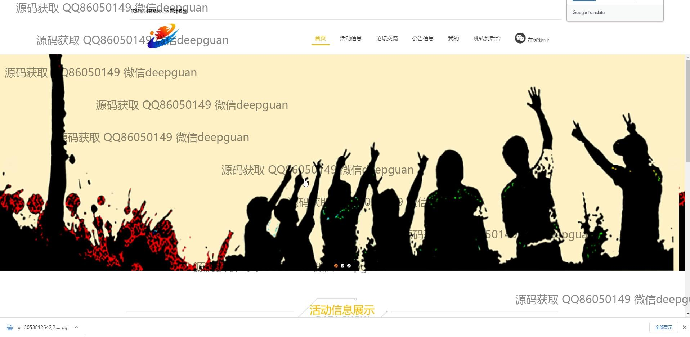
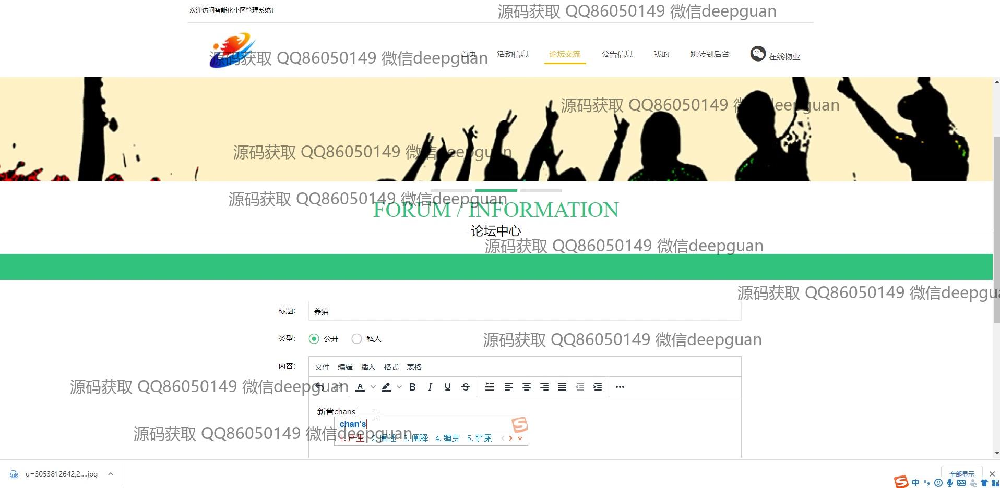
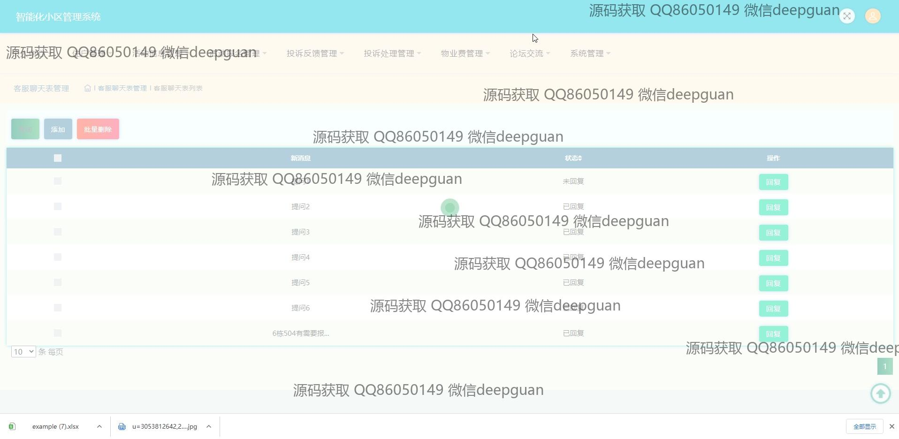

<h1 align="center">的智能化社区活动报名小区管理系统</h1>

## 简介
智能化社区活动报名小区管理系统：角色分为管理员和用户；功能包括活动信息管理、住户管理、投诉处理、物业费管理和论坛交流，旨在提高社区管理效率和用户参与度。    --计算机毕业设计源码；毕设源码；java毕业设计源码

## 联系方式

<h3 align="center">获取完整代码与数据库文件 + 微信：deepguan QQ: 86050149 QQ群: 783742310</h3>

<h3 align="center">可帮忙远程部署 包运行成功！提供远程部署、修改代码、设计文档指导、代码讲解等服务！</h3>

## 功能介绍（完整见运行截图）
管理员：基本功能包括用户登录和注册，活动信息管理和报名管理，公告管理和论坛交流管理，处理投诉反馈，物业费管理。同时可通过后台查看住户信息、活动报名情况、投诉状态等，以便有效组织和协调社区活动。用户界面提供活动发布及管理功能，支持用户信息编辑，物业缴费记录管理，和投诉处理的进度跟踪。此外，系统支持多种支付方式，提升社区管理效率。

住户：可通过系统首页主导航栏访问活动信息和论坛交流模块，查看公告信息和参与社区活动。系统支持住户注册和个人信息查看与修改，通过参与社区活动提升邻里互动。住户可发布和编辑论坛帖子，与其他住户互动交流，浏览公告通知，及时获取社区信息，并通过客服聊天进行实时问题咨询。用户还可在个人中心查看报名信息和物业费状态，两者支持在线缴费和信息更新。

## 运行截图

本代码来源于网络,仅供学习参考使用!

